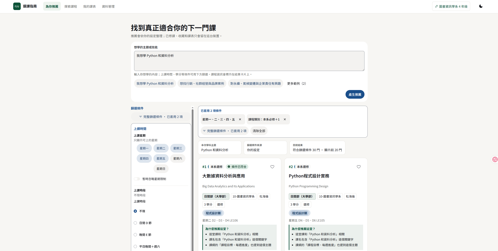

# 輔仁大學課程推薦系統

[English](README-en.md) | [繁體中文](README.md)

本專案是一套提供輔仁大學學生使用的開源課程探索與選課決策支援系統。

本系統結合結構化課程大綱資料、語意檢索、BM25 詞彙搜尋、資格規則、篩選條件與課表資訊，協助學生探索並比較課程。

> 本專案是獨立的開源專案，不是輔仁大學官方服務。

## 線上展示

**線上展示網站：** https://crs.sixhuang.com



## 功能

* **語意課程搜尋** — 使用自然語言描述想學習的內容，不必只依賴完全符合的課程名稱。
* **混合式檢索** — 結合課程向量嵌入與依欄位加權的 BM25 詞彙搜尋。
* **考量修課資格的推薦** — 使用可取得的修課層級、系所、年級、先修課程與適合對象等資訊。
* **課程篩選** — 可依上課時間、學分、課程類型、系所、教學方式、評量方式、授課語言及其他可用資料欄位篩選課程。
* **課表與衝堂偵測** — 比較課程時，同時偵測課程與現有課表之間的時間衝突。
* **課程家族去重與多樣性** — 將高度相關的開課項目分組，並使用考量多樣性的排序方式，避免結果清單被幾乎重複的課程占滿。
* **以本機為優先的學生資料** — 個人資料、已修課程、收藏課程、略過的課程、課表與推薦偏好都儲存在瀏覽器的 IndexedDB 中。
* **核心推薦流程不使用生成式大型語言模型** — 主要推薦器使用向量嵌入、確定性的查詢處理、篩選與排序，而不是 Chat Completion。
* **可選的複合查詢分析** — 確定性的前端解析器可以辨識多個目標、排除條件、情境與支援的硬性限制。此功能由 `FJU_COMPOUND_QUERY_ENABLED` 控制，預設停用。

## 推薦如何運作

推薦流程主要在瀏覽器中執行。

```text
使用者查詢
    │
    ├─────────────────────────────────────┐
    │                                     │
    ▼                                     ▼
FastAPI 查詢向量嵌入 API              確定性的查詢分析
    │                               （啟用時才執行）
    ▼                                     │
查詢向量                                  │
    │                                     │
    └─────────────────┬───────────────────┘
                      ▼
              瀏覽器端排序
                      │
        ┌─────────────┴─────────────┐
        ▼                           ▼
密集語意排序                   BM25 詞彙排序
        │                           │
        └─────────────┬─────────────┘
                      ▼
              倒數排名融合
              （RRF）
                      │
                      ▼
             修課資格／硬性限制
             課表／使用者選定的篩選條件
                      │
                      ▼
                課程家族分組
                      │
                      ▼
              多樣性選擇（MMR）
                      │
                      ▼
                推薦課程
```

### 密集檢索

課程向量嵌入會從後端下載，並由前端快取。每次收到查詢時，後端會產生相容的查詢向量嵌入，接著由瀏覽器將它與各課程向量進行比較。

目前固定使用的正式環境產物（production artifact）如下：

|                |                              |
| -------------- | ---------------------------- |
| 模型           | `google/embeddinggemma-300m` |
| 維度           | `768`                        |
| 向量型別       | `float32`                    |
| 課程目錄結構   | `fju_catalog_v4`             |
| 課程紀錄數     | `4,565`                      |

確切的模型版本、標準資料校驗碼、產物校驗碼與建置中繼資料，記錄在：

[`artifact-locks/1151-embeddinggemma-768.json`](artifact-locks/1151-embeddinggemma-768.json)

### 詞彙檢索

前端也會針對以下欄位建立依欄位加權的 BM25 索引：

* 課程名稱
* 課程目標
* 每週進度
* 先修課程
* 教材
* 技能

系統會使用**倒數排名融合（Reciprocal Rank Fusion，RRF）**，將密集檢索與詞彙檢索的排序結果合併。

### 修課資格、篩選與多樣性

在一門課程被呈現為推薦之前，前端可以考量以下資訊：

* 學生個人資料與修課層級
* 系所關係
* 已修課程
* 已知的先修課程
* 現有課表的衝堂情況
* 偏好的上課星期
* 課程類別
* 學分
* 進階課程篩選條件
* 支援的查詢層級硬性限制

已確認的限制可能會直接排除某門課。若系統無法從現有資料判斷某項條件，則可以將它標記為需要確認，而不是直接判定為不符合。

檢索完成後，相似的開課項目會被分成課程家族，並使用**最大邊際相關性（Maximal Marginal Relevance，MMR）**步驟提升結果多樣性。簡單來說，MMR 會在相關性與避免重複之間取得平衡。

### 複合查詢

本儲存庫也包含一個可選的確定性查詢分析層，可處理以下類型的查詢：

```text
資料庫＋後端
企業法務實習
不要星期三的通識
```

它可以辨識受支援的關係，例如單一目標、涵蓋、交集、篩選、排除，以及特定的資料欄位限制。

它**不會**使用生成式大型語言模型解讀這些搜尋內容。

此功能預設停用：

```text
FJU_COMPOUND_QUERY_ENABLED=0
```

此功能的評估資料位於 [`evaluation/`](evaluation/)。

## 系統架構

```text
┌──────────────────────────────────────────────┐
│                  瀏覽器                      │
│                                              │
│ React / TypeScript                           │
│                                              │
│ • 課程探索介面                               │
│ • 查詢分析                                   │
│ • 修課資格與課表檢查                         │
│ • 密集檢索 + BM25 + RRF 排序                 │
│ • 課程家族分組 + MMR                         │
│ • IndexedDB 使用者資料                      │
│ • 快取的課程目錄與向量產物                   │
└──────────────────────┬───────────────────────┘
                       │ HTTP
                       ▼
┌──────────────────────────────────────────────┐
│                  FastAPI                     │
│                                              │
│ • 課程目錄 API                               │
│ • Facet／系所中繼資料                        │
│ • 查詢向量嵌入                               │
│ • 課程目錄與向量嵌入產物                     │
│ • 可選的分析功能                             │
│ • 可選的 AI 助理                             │
└──────────────────────┬───────────────────────┘
                       │
                       ▼
┌──────────────────────────────────────────────┐
│               產物套件                       │
│                                              │
│ 標準課程目錄                                 │
│ 課程向量嵌入                                 │
│ 向量嵌入索引                                 │
│ 查詢路由產物                                 │
│ 固定版本的模型執行環境                       │
└──────────────────────────────────────────────┘
```

### 主要技術

| 層級             | 技術                         |
| ---------------- | ---------------------------- |
| 前端             | React 19、TypeScript、Vite   |
| 使用者介面       | HeroUI、Tailwind CSS         |
| 用戶端狀態       | IndexedDB、TanStack Query    |
| 後端             | FastAPI                      |
| 向量嵌入         | EmbeddingGemma               |
| 檢索             | 密集檢索 + BM25 + RRF        |
| 多樣性處理       | MMR                          |
| 資料處理流程     | Python                       |
| 部署             | Docker                       |

## 資料集與資料處理流程

目前的正式環境產物是以輔仁大學以下條件的課程大綱資料為基礎：

* 學年度：**115**
* 學期：**1**
* 課程類型：`100`
* 語言設定：`1028`

爬蟲會存取輔仁大學課程大綱系統使用的公開 JSON API。

資料處理流程如下：

```text
探索課程
      ↓
系所中繼資料
      ↓
爬取課程
      ↓
資料正規化
      ↓
資料驗證
      ↓
標準 JSONL
      ↓
建置向量嵌入產物
```

主要 CLI（命令列介面）指令如下：

```bash
fju-outline discover --hy 115 --ht 1
fju-outline departments --hy 115 --lcid 1028
fju-outline crawl --hy 115 --ht 1
fju-outline normalize --hy 115 --ht 1
fju-outline export --hy 115 --ht 1
fju-outline validate --hy 115 --ht 1
```

### 比較課程搜尋資料與課程大綱

兩個學生課程搜尋頁面會透過其公開 JSON API 查詢。稽核工具使用 Scrapling，儲存原始回應，並將課程 ID 與課程代碼變體和標準課程大綱 JSONL 進行比較：

```bash
python scripts/course_search_audit.py --hy 115 --ht 1 --page-size 100 --concurrency 3
```

預設情況下，快照與報告會寫入 `tmp/course_search_audit_<hy><ht>/`。報告會記錄兩個資料來源的擷取時間，因為不同日期之間的數量不一致，本身並不能證明爬蟲漏抓了資料。

爬取產生的原始課程資料、標準資料集、衍生資料表與正式環境產物套件，不會全部提交到本儲存庫。

目前受 Git 追蹤的 `data/` 目錄包含本專案使用的參考資料，例如系所中繼資料與系所比對審查資料。

相容於正式環境的 EmbeddingGemma 建置工具是：

[`scripts/build_embedding_bundle.py`](scripts/build_embedding_bundle.py)

產物驗證功能實作於：

[`scripts/verify_artifact_bundle.py`](scripts/verify_artifact_bundle.py)

## 快速開始

### 系統需求

* Python 3.11 以上
* Node.js
* pnpm

複製儲存庫：

```bash
git clone https://github.com/hyslchs/Course_Recommender_System.git
cd Course_Recommender_System
```

建立 Python 虛擬環境：

```bash
python -m venv .venv
```

啟用虛擬環境：

```bash
# Linux / macOS
source .venv/bin/activate
```

```powershell
# Windows PowerShell
.venv\Scripts\Activate.ps1
```

安裝後端、資料處理流程與測試所需的依賴套件：

```bash
pip install -e ".[pipeline,test]"
```

執行後端測試：

```bash
pytest -q
```

### 前端開發

```bash
cd frontend
pnpm install
pnpm test
pnpm dev
```

Vite 開發伺服器會將 `/api` 與 `/health` 代理到：

```text
http://127.0.0.1:8080
```

### 執行完整應用程式

全新複製的儲存庫不包含完整的正式環境產物套件。

後端需要一個相容的向量產物目錄，其中包含課程目錄、向量嵌入索引、課程向量與模型中繼資料。

如果你已經有相容的產物套件：

```bash
fju-outline-web \
  --artifacts-dir /path/to/vector-artifacts \
  --port 8080
```

接著在另一個終端機執行前端：

```bash
cd frontend
pnpm dev
```

如果要重新建置固定版本的 EmbeddingGemma 產物格式，請使用以下指令查看建置工具選項：

```bash
python scripts/build_embedding_bundle.py --help
```

使用產生的正式環境套件之前，可以用以下指令進行檢查：

```bash
python scripts/verify_artifact_bundle.py --help
```

## 評估

本儲存庫在 [`evaluation/`](evaluation/) 下包含推薦與複合查詢的評估資源。

其中包括：

* `relevance_v1.json`
* `manual_test_cases_v1.csv`
* `manual_test_cases_v1.json`
* `compound_queries_v1.json`
* RESQUE 使用者模擬報告

混合式推薦評估器會使用 **Recall@10** 與 **NDCG@10**，比較密集檢索和混合式排序的結果：

```bash
python -m fju_outline.evaluation \
  --artifacts-dir /path/to/vector-artifacts
```

複合查詢的評估資料與審查狀態記錄在：

[`evaluation/README.md`](evaluation/README.md)

部分評估檔案明確標示為草稿或需要人工審查，不應自動視為已驗證的相關性標註基準資料。

## 本機資料與可選服務

學生端應用程式資料儲存在瀏覽器的 IndexedDB 中。

目前的資料儲存區包括：

```text
profile
completedCourses
favorites
dismissedCourses
schedulePlans
recommendationPreferences
catalogCache
preferences
```

本儲存庫另外包含兩項可選的伺服器端功能：

**產品分析**

後端與前端都支援分析功能，但範例設定預設停用資料收集：

```text
FJU_ANALYTICS_ENABLED=0
```

**AI 課程助理**

本專案也另外實作了可選的 AI 課程助理，與主要推薦器分開。啟用它需要明確設定 `OPENAI_API_KEY`。

範例設定中的金鑰欄位是空白的，因此此功能預設不會啟用。

這兩項功能都不是核心語意推薦流程的必要條件。

可用的執行環境設定請參閱 [`.env.example`](.env.example)。

## 儲存庫結構

```text
.
├── .github/
│   └── workflows/             # CI（持續整合）
├── artifact-locks/            # 固定版本正式環境產物的中繼資料
├── assets/
│   └── overview.png           # README 截圖
├── data/
│   └── reference/             # 受 Git 追蹤的參考資料集
├── evaluation/                # 推薦與查詢評估資料
├── frontend/                  # React / TypeScript 應用程式
├── scripts/                   # 產物與部署工具
├── src/
│   └── fju_outline/           # 後端、爬蟲、資料處理流程與評估程式碼
├── .env.example
├── Dockerfile
├── compose.yaml
├── pyproject.toml
├── THIRD_PARTY_NOTICES.md
├── LICENSE
├── README-en.md
└── README.md                # 預設繁體中文版 README
```

## 開發

後端：

```bash
pip install -e ".[pipeline,test]"
pytest -q
```

前端：

```bash
cd frontend
pnpm install
pnpm test
pnpm build
```

如果修改了向量嵌入產生、詞彙檢索、排序、修課資格規則或複合查詢行為，也應使用相關評估資料進行檢查。

## 授權條款

本專案開發的原始碼採用 **Apache License 2.0** 授權。

本儲存庫原始碼所使用的 Apache License 2.0，不會自動套用到以下第三方素材：

* 輔仁大學課程資料
* EmbeddingGemma 模型檔案
* Noto Sans TC
* 第三方 Python 與 JavaScript 依賴套件
* 其他由外部提供的資料或服務

這些素材仍受各自的授權條款、使用條件與適用法律規範。

詳情請參閱：

* [LICENSE](LICENSE)
* [THIRD_PARTY_NOTICES.md](THIRD_PARTY_NOTICES.md)

## 免責聲明

本專案是用於課程探索、推薦系統研究與選課決策支援的獨立工具。

推薦結果與修課資格評估僅供參考。

正式的開課狀態、選課限制、先修課程、修課人數上限、上課時間與其他註冊要求，應一律透過輔仁大學官方系統確認。
