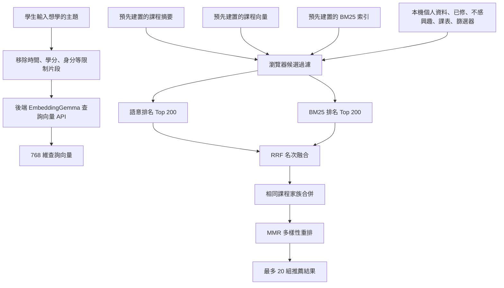

# 「為你推薦」推薦引擎技術文件

註：此文件由 GPT 5.6 Sol High 輔助撰寫，經人工檢視確認資訊無誤

## 目錄

1. [系統定位與範圍](#1-系統定位與範圍)
2. [給非技術讀者的摘要](#2-給非技術讀者的摘要)
3. [名詞說明](#3-名詞說明)
4. [整體架構與資料流](#4-整體架構與資料流)
5. [離線階段：課程資料與向量產物](#5-離線階段課程資料與向量產物)
6. [線上階段：從輸入到查詢向量](#6-線上階段從輸入到查詢向量)
7. [候選課程過濾](#7-候選課程過濾)
8. [密集語意排序](#8-密集語意排序)
9. [BM25 詞彙排序](#9-bm25-詞彙排序)
10. [RRF 混合排序](#10-rrf-混合排序)
11. [課程家族合併](#11-課程家族合併)
12. [MMR 多樣性重排](#12-mmr-多樣性重排)
13. [推薦理由與結果資料](#13-推薦理由與結果資料)
14. [完整演算法與計算範例](#14-完整演算法與計算範例)
15. [預設行為與個人化範圍](#15-預設行為與個人化範圍)
16. [快取、隱私與前後端責任](#16-快取隱私與前後端責任)
17. [可重現性與產物完整性](#17-可重現性與產物完整性)
18. [測試與評估](#18-測試與評估)
19. [效能與計算複雜度](#19-效能與計算複雜度)

---

## 1. 系統定位與範圍

### 1.1 一句話定位

「為你推薦」是一個**內容式混合檢索推薦系統**：它比較學生輸入與課程內容的語意和關鍵字，再用明確規則處理資格、時間、課表與其他篩選條件，最後降低重複課程。

這個名稱包含三個重點：

- **內容式（content-based）**：主要根據課名和課綱內容，不是根據「和你相似的學生修了什麼」。
- **混合檢索（hybrid retrieval）**：同時使用向量語意檢索與 BM25 關鍵字檢索。
- **規則式個人化**：個人資料用於課程類別、資格與可修條件；目前不會學習個人口味。

### 1.2 明確不在本文件範圍內的功能

本文件不包含 AI 小幫手。推薦頁的核心流程不呼叫生成式大型語言模型，也不由模型撰寫推薦課名或決定答案。它只會在正式課程目錄中篩選與排序。

專案中雖然另有 AI 小幫手程式碼及功能旗標，但這是獨立流程，不應混入「為你推薦」的演算法說明。

### 1.3 系統不應被描述成什麼

目前不應將本系統描述為：

- 能預測學生選課機率的模型；
- 會依收藏或點擊自動學習偏好的模型；
- 協同過濾（collaborative filtering）系統；
- 能完全理解任意自然語言限制的代理人；
- 能取代校務系統確認名額與修課資格的工具。

---

## 2. 給非技術讀者的摘要

系統可理解為六個步驟：

1. **先準備課程的數字表示**：把每門課的課程目標、每週進度、先修與技能轉成 768 個數字。
2. **把學生需求也轉成數字**：例如「Python 資料分析」也轉成相同格式的 768 個數字。
3. **先過濾不能顯示的課**：例如已修過、不感興趣、星期不符、衝堂或明確資格不符。
4. **做兩種搜尋**：一種理解整體語意，另一種尋找明確關鍵字。
5. **合併兩份名次**：兩種搜尋都排得前面的課，整體分數較高。
6. **去除重複並增加多樣性**：相同課程的不同班別合併；過度相似的結果不連續占滿前幾名。

核心觀念是：**先確保條件合規，再比較相關性，最後處理重複性。**

---

## 3. 名詞說明

| 名詞 | 中文理解 | 在本系統中的用途 |
|---|---|---|
| Embedding | 向量嵌入；把文字轉成一串數字 | 表示查詢和課程語意 |
| Vector | 向量；有固定順序的一組數字 | 本系統使用 768 維向量 |
| Dense retrieval | 密集檢索／語意檢索 | 找到語意相近、未必使用相同字詞的課程 |
| Sparse retrieval | 稀疏檢索／詞彙檢索 | 找到明確出現關鍵字的課程 |
| Cosine similarity | 餘弦相似度 | 衡量兩個文字向量的方向是否接近 |
| BM25 | 常見的關鍵字排名公式 | 考慮詞頻、詞的稀有度與文件長度 |
| RRF | 倒數排名融合 | 用名次而不是原始分數合併兩種搜尋 |
| MMR | 最大邊際相關性 | 在相關性與結果多樣性間取平衡 |
| L2 normalization | L2 正規化 | 將向量長度調整為 1，方便穩定比較 |
| Hard filter | 硬性篩選 | 不符合就直接不進候選清單 |
| Hyperparameter | 超參數 | 由工程設計設定、不是模型自動學出的常數 |
| Artifact | 模型產物／建置產物 | 預先產生的課程向量、索引與課程摘要 |
| IndexedDB | 瀏覽器本機資料庫 | 快取大型課程資料及儲存個人設定 |

---

## 4. 整體架構與資料流



### 4.1 前後端分工

| 工作 | 執行位置 |
|---|---|
| 課綱正規化、資格規則抽取、課程向量建置 | 離線 Python 建置流程 |
| 查詢文字轉向量 | FastAPI 後端 |
| 載入課程摘要、向量與 BM25 索引 | 瀏覽器 |
| 個人條件、課表與篩選 | 瀏覽器 |
| 候選過濾、兩路排名、RRF、課程家族、MMR | 瀏覽器 |
| 展示結果與課程卡片 | React 前端 |

後端不會回傳一份已排好的推薦清單。後端只提供查詢向量及靜態產物；真正的個人化篩選與排序在瀏覽器內完成。

---

## 5. 離線階段：課程資料與向量產物

### 5.1 正式產物版本

目前鎖定檔 `artifact-locks/1151-embeddinggemma-768.json` 記錄：

| 項目 | 值 |
|---|---|
| 學期資料 | 115 學年度第 1 學期 |
| 課程紀錄數 | 4,565 |
| 模型 | `google/embeddinggemma-300m` |
| 模型 revision | `57c266a740f537b4dc058e1b0cda161fd15afa75` |
| 向量維度 | 768 |
| 數值型別 | `float32` |
| 課程 schema | `fju_catalog_v4` |
| 合併演算法標記 | `section-pooling-v1` |

revision 是指定的模型版本識別碼。固定 revision 可以避免上游同名模型更新後，查詢向量與既有課程向量悄悄變得不相容。

### 5.2 課程向量使用哪些內容

每門課不是把整份課綱直接串成一段，而是分別建立四個區段向量：

| 區段 | 權重 | 來源與意義 |
|---|---:|---|
| `objective` | 0.45 | 中文／英文課名加課程目標 |
| `weekly_progress` | 0.30 | 每週主題與單元 |
| `prerequisite` | 0.15 | 先修內容 |
| `skills` | 0.10 | 課名加核心能力、專門議題與創新特點 |

教材與評量資料會出現在課程資料及 BM25 索引中，但**目前不參與課程密集向量的四區段加權**。

若某個區段沒有文字，建置器會退回使用中文課名、英文課名或「課程」，避免產生空輸入。

### 5.3 文件向量公式

設一門課的四個區段向量為：

- \(\vec v_o\)：課程目標；
- \(\vec v_w\)：每週進度；
- \(\vec v_p\)：先修內容；
- \(\vec v_s\)：技能資訊。

加權後的課程向量為：

\[
\vec c_{raw}
=0.45\vec v_o
+0.30\vec v_w
+0.15\vec v_p
+0.10\vec v_s
\]

接著執行 L2 正規化：

\[
\vec c=\frac{\vec c_{raw}}{\max(\|\vec c_{raw}\|_2,10^{-12})}
\]

分母中的 \(10^{-12}\) 是極小保護值，用來避免零向量造成除以零。

### 5.4 模型輸入格式

EmbeddingGemma 的固定模板為：

```text
文件：title: {title} | text: {text}
查詢：task: search result | query: {query}
```

目前四個課程區段透過 `encode_passages()` 建立，因此文件模板中的 title 參數使用預設值 `none`；真正的課名已由 `_document_sections()` 放進 `objective` 與 `skills` 文字。這是實作細節，若未來要改成把課名正式傳入模板，必須重建全部課程向量，不能只修改查詢端。

### 5.5 正規化與相容性

模型產出的每個區段向量先正規化；四個區段加權相加後，再正規化一次。正式產物與即時查詢必須同時符合：

- 相同模型 ID；
- 相同模型 revision；
- 相同 tokenizer revision；
- 相同向量維度；
- 相同文件與查詢 prompt 模板。

任何一項不一致，都可能讓語意分數失去意義。

### 5.6 主要靜態產物

| 檔案 | 用途 |
|---|---|
| `catalog.json` | 完整課程資料 |
| `catalog-summary.json` | 推薦首屏需要的精簡課程資料與 BM25 索引 |
| `course-embeddings.f32` | 依 course ID 順序排列的 `float32` 課程向量 |
| `embedding-index.json` | 課程 ID、維度與向量資料型別 |
| `artifact-manifest.json` | 版本、雜湊、模型與產物中繼資料 |
| `query-route-*` | 查詢路由實驗產物；目前不是「為你推薦」頁面的必要輸入 |

---

## 6. 線上階段：從輸入到查詢向量

### 6.1 輸入前提

使用者必須先完成個人設定，且推薦頁要求：

- 主題文字不可為空；
- 移除限制片段後，仍必須留下可搜尋的學習主題；
- 至少選擇一個偏好的上課星期。

### 6.2 查詢清理

使用者輸入不會一律原封不動送進向量模型。`sanitizeSubjectQuery()` 會先執行 NFKC Unicode 正規化，再辨識並移除下列片段：

- 個人身分，例如「我是資工系二年級學生」；
- 排除描述，例如「不要……」；
- 星期、白天、晚上、避免衝堂等時間要求；
- 學分要求；
- 學制或部別；
- 無先修要求；
- 本系、外系、通識、必修或選修等課程範圍。

例如：

```text
原始輸入：我是資工系二年級，想學 Python，只能星期二晚上，不要高階先修
主題查詢：Python
移除片段：個人身分、上課時間、排除／先修描述
```

這樣做是為了避免「不要星期三」中的「星期三」或「不要高階課」中的「高階課」反而因語意相近而被推薦。

但要注意：**偵測到不等於已套用**。目前頁面會提醒使用者改用正式篩選器；它不會自動把所有自然語言限制轉成篩選狀態。

### 6.3 查詢向量 API

前端將清理後的 `subjectQuery` 送到：

```http
POST /api/v1/query-embedding
Content-Type: application/json

{"text":"Python 資料分析"}
```

後端使用與課程產物相容的 EmbeddingGemma encoder，回傳：

```json
{
  "vector": [/* 768 個 float */],
  "model_version": "57c266a...",
  "dimension": 768
}
```

後端會驗證向量必須是一維，且長度必須等於產物 manifest 的維度；不相容時回傳服務錯誤，不讓錯誤向量繼續排名。

### 6.4 平行載入

推薦頁一開啟就預先載入課程摘要、BM25 索引和課程向量。使用者按下「產生推薦」後，前端會平行等待：

1. 靜態推薦產物；
2. 即時查詢向量。

兩者都完成後才進入瀏覽器排序，避免不必要的循序等待。

---

## 7. 候選課程過濾

目前實作是在計算每門候選課的語意與詞彙排名之前，先逐門檢查條件。這代表被硬性過濾的課程不會進入後續 Top 200。

### 7.1 實際檢查順序

對每門課依序執行：

1. 必須存在對應課程向量。
2. 排除相同 course ID 的已修課程。
3. 排除被標記「不感興趣」的 course ID。
4. 評估修課資格。
5. 若頁面傳入明確學制層級篩選，檢查大學部／研究所相容性。
6. 若啟用避開課表，排除與課表課程衝堂者。
7. 若啟用避開課表，排除與固定行程衝堂者。
8. 套用日間、晚間或「平日晚間＋週六」時段。
9. 套用完整進階篩選。
10. 套用偏好星期。
11. 套用學分。
12. 套用官方課程標籤。
13. 套用程式傳入的其他硬條件；目前推薦頁沒有傳入此欄位。
14. 分類為本系必修、本系選修、通識或外系。
15. 套用課程類別；沒有選類別時，才套用「必修／選修」。

### 7.2 已修與不感興趣

- **已修課程**：以 course ID 排除本門課；課名另外用於判斷形式化先修課是否完成。
- **不感興趣**：以 course ID 排除，不會降低同主題其他課程的分數，也不會訓練偏好模型。

因此，「不感興趣」目前是確定性隱藏，不是負向偏好學習。

### 7.3 修課資格狀態

資格評估可能得到四種狀態：

| 狀態 | 意義 |
|---|---|
| `eligible_confirmed` | 現有資料顯示條件已符合 |
| `no_known_restriction` | 尚未看見明確限制；不等於校方保證可修 |
| `needs_confirmation` | 有規則，但現有資料不足以確定 |
| `blocked_confirmed` | 現有結構化規則判定不符合 |

前端會處理的規則包括：

- 形式化先修課程；
- 最低年級；
- 指定年級；
- 指定部別；
- 指定系所；
- 課程授課對象年級；
- 無法自動判斷的其他限制。

課程的研究所／博士班標示目前被視為資訊，不會單獨成為資格硬擋。若要限制學制，應使用頁面的「學制」篩選。

### 7.4 形式化先修的保守例外

目前有一項刻意保守的例外：

- 若 `blocked_confirmed` 中包含尚未匹配到的 `course_prerequisite`，課程仍保留在候選中，交由課程卡片提示使用者確認。
- 若明確不符只來自年級、部別或系所等規則，則直接排除。

原因是已修課名與課綱先修名稱未必能可靠一一對應，直接排除可能產生誤殺。

但現有條件寫法只要 blocked 清單中**存在任何一個**未完成形式化先修，就會保留課程，即使同一門課還同時有其他不符合規則。這是需要後續細化的風險。

### 7.5 星期與未知時間

若「暫時忽略星期限制」關閉：

- 一門課所有已知 meeting 的 weekday 都必須在偏好星期內；
- 只要有一個 meeting 落在未選星期，就會被排除；
- 完全沒有已知時間時，是否保留由 `includeUnknownSchedule` 決定。

新頁面的預設是星期一至五、限制生效，但允許時間未知的課程。

### 7.6 時段規則

| 篩選 | 判斷方式 |
|---|---|
| 日間 | 所有節次必須以 `D` 開頭 |
| 晚間 | 所有節次必須以 `E` 開頭 |
| 平日晚間＋週六 | 非星期六 meeting 必須全為 `E`；星期六不限 D/E |
| 精確節次 | 課程只要包含任一個所選節次就符合 |

精確節次採「任一符合」（OR），不是要求同時包含所有選定節次。

### 7.7 衝堂判斷

兩個 meeting 必須同時符合以下條件才可能衝堂：

1. weekday 相同；
2. 至少一個 section 相同；
3. 週次型態相同，或其中一方為 `A`（全週）。

如果星期或週次資料缺失，系統可能標記為不確定；主推薦過濾只排除 `conflict=true`，不確定衝堂會保留，避免資料不足時過度排除。

### 7.8 進階篩選的布林邏輯

| 條件 | 邏輯 |
|---|---|
| 多個課程類別 | OR，符合任一類即可 |
| 多個學分 | OR |
| 多個官方標籤 | OR |
| 每一組能力／議題內 | OR |
| 不同能力／議題組之間 | AND |
| 多個教師 | OR |
| 多個開課單位 | OR |
| 多個語言 | OR |
| 不同種類的篩選器之間 | AND |

教學方法與評量方式可以要求：

- 該方法在課程中占比最高；或
- 該方法占比至少達指定百分比。

評量風格會將原始評量 ID 分為考試、寫作、發表合作、實作展演及參與等家族，再比較各家族加總占比。

### 7.9 課程類別

分類規則為：

1. 同系且標示必修 → `home_required`；
2. 同系且不是通識 → `home_elective`；
3. 標示通識 → `general_education`；
4. 其餘 → `external_department`。

「同系」優先使用正式 department identity、代碼、部別代碼與單位類型比對；資料不足時才退回正規化後的中文名稱。

如果已選取課程類別，程式不再套用獨立的「必修／選修」篩選。也就是課程類別的優先權較高。

---

## 8. 密集語意排序

### 8.1 計算公式

對候選課程 \(i\)，查詢向量為 \(\vec q\)，課程向量為 \(\vec c_i\)：

\[
S_{dense}(i)=\vec q\cdot\vec c_i
\]

由於查詢向量和課程向量都經過 L2 正規化，其長度約為 1，因此點積等價於餘弦相似度：

\[
\vec q\cdot\vec c_i
=\frac{\vec q\cdot\vec c_i}{\|\vec q\|\|\vec c_i\|}
=\cos(\theta)
\]

方向越接近，分數越高。這使系統可以找到沒有逐字出現查詢字詞、但課綱意思相近的課程。

### 8.2 排名與截斷

所有通過過濾的候選依 `denseScore` 由大到小排列，取前 200 名。分數相同時，以原始課程目錄順序作為穩定的決勝條件。

語意分數不直接顯示為「適合百分比」，也不代表學生喜歡或選修的機率。

---

## 9. BM25 詞彙排序

### 9.1 為什麼還需要關鍵字搜尋

語意模型適合處理同義或近義內容，但對課號、技術名詞、程式語言或精確課名，關鍵字通常更可靠。因此系統同時建立 BM25 索引。

### 9.2 文字正規化與切詞

索引和查詢都會：

1. 執行 NFKC Unicode 正規化；
2. 轉成小寫；
3. 保留英文／數字技術詞，例如 `C++`、`C#`；
4. 中文連續文字產生單字元 token；
5. 中文連續文字產生相鄰雙字元 token；
6. 加入 Unicode 字母／數字組成的完整詞段。

例如「資料科學」至少會產生「資、料、科、學、資料、料科、科學」等 token，並保留完整詞段。這不是斷詞模型，而是確定性的字元與 bigram（雙字組）策略。

### 9.3 欄位權重

| 欄位 | 權重 |
|---|---:|
| 課名 `title` | 3.2 |
| 課程目標 `objective` | 1.8 |
| 每週進度 `weekly_progress` | 1.3 |
| 先修 `prerequisite` | 1.0 |
| 教材 `materials` | 0.9 |
| 技能 `skills` | 0.8 |

課名權重最高，避免只有課綱深處偶然出現關鍵字的課程壓過課名直接吻合者。

### 9.4 單一欄位 BM25

對查詢詞 \(t\)、欄位 \(f\)、課程 \(d\)：

\[
IDF_f(t)=\ln\left(1+\frac{N-df_f(t)+0.5}{df_f(t)+0.5}\right)
\]

\[
BM25_f(t,d)=IDF_f(t)\times
\frac{tf_f(t,d)(k_1+1)}
{tf_f(t,d)+k_1\left(1-b+b\frac{|d_f|}{avg_f}\right)}
\]

目前參數：

- \(k_1=1.2\)：控制同一詞重複出現後的邊際加分；
- \(b=0.75\)：校正欄位長度；
- \(N\)：課程總數；
- \(df_f(t)\)：在欄位 \(f\) 出現查詢詞的課程數；
- \(tf_f(t,d)\)：查詢詞在該課程欄位中的次數；
- \(|d_f|\)：該課程欄位 token 數；
- \(avg_f\)：此欄位在全課程中的平均 token 數。

BM25 的直觀效果是：

- 少見而有辨識力的詞加分較高；
- 同一詞多次出現仍會加分，但逐漸飽和；
- 很長的課綱不會只因字多而天然占優勢。

`N`、`df` 與平均欄位長度是在建立索引時以完整課程目錄計算，不會因為學生當下的系所、星期或其他候選篩選而重新計算。換句話說，篩選會改變哪些課可以參加排名，但不會改變一個詞在整體課程資料中的稀有程度。

### 9.5 跨欄位原始分數

\[
S_{raw}(d)=\sum_f w_f\sum_{t\in Q}BM25_f(t,d)
\]

其中 \(w_f\) 是上一節的欄位權重。

### 9.6 課名訊號與最終詞彙分數

令：

- `exactTitle = 1`：移除空白後，課名文字**包含**完整查詢；名稱雖叫 exact，但實作是 substring（子字串）包含，不要求完全相等。
- 否則 `titleMatch` = 課名命中的查詢 token 數 ÷ 查詢 token 數。

先把 BM25 原始分數壓縮到 0–1 附近：

\[
S_{body}=1-e^{-S_{raw}/8}
\]

再與課名訊號合成：

\[
S_{lexical}=Clamp_{[0,1]}
\left(0.55S_{body}+0.45S_{title}\right)
\]

詞彙排序時依序比較：

1. 是否 `exactTitle`；
2. `lexical.score`；
3. `titleMatch`；
4. 原始課程順序。

只保留分數大於 0 的前 200 名。

---

## 10. RRF 混合排序

### 10.1 為什麼不用原始分數直接相加

語意餘弦分數與 BM25 詞彙分數的形成方式和分布不同。若直接相加，必須另外決定兩者的換算比例，且換模型或資料後可能失衡。

RRF（Reciprocal Rank Fusion，倒數排名融合）只使用名次，因此不必假設兩種分數可直接比較。

### 10.2 公式

令課程 \(d\) 在語意清單的名次為 \(r_d^{dense}\)，在詞彙清單的名次為 \(r_d^{sparse}\)：

\[
S_{RRF}(d)=
\mathbf{1}_{dense}(d)\frac{1}{60+r_d^{dense}}
+
\mathbf{1}_{sparse}(d)\frac{1}{60+r_d^{sparse}}
\]

其中：

- 常數 \(k=60\)；
- 名次從 1 開始；
- 若課程不在其中一份 Top 200，只取得另一份清單的分數；
- 若兩份清單都沒有該課程，該課不再進入後續流程。

### 10.3 範例

假設課程 A：

- 語意排名第 2；
- 詞彙排名第 5。

則：

\[
S_{RRF}(A)=\frac{1}{62}+\frac{1}{65}
\approx0.01613+0.01538
=0.03151
\]

課程 B 在兩份清單都排名第 20：

\[
S_{RRF}(B)=\frac{1}{80}+\frac{1}{80}=0.025
\]

所以 A 排在 B 前面。

### 10.4 RRF 排序的決勝順序

融合後依序比較：

1. RRF 分數；
2. 原始語意分數；
3. 原始 BM25 詞彙分數；
4. 課程目錄原始順序。

最大可能 RRF 分數是兩份清單都排名第 1：

\[
S_{max}=\frac{2}{61}\approx0.03279
\]

RRF 分數很小是公式本身的正常結果，不是低推薦品質，也不是機率。

---

## 11. 課程家族合併

不同班別、共同開課或跨列課程可能具有相同內容。如果不合併，前幾名可能被同一門課占滿。

### 11.1 必要條件

兩筆課程要成為同一家族，首先必須：

- 正規化後中文課名完全相同；
- 若兩邊學分皆已知，學分必須相同。

課名正規化會移除大小寫差異、空白、標點與符號。

### 11.2 額外證據

在必要條件成立後，以下任一證據即可合併：

1. 教師名稱相同；
2. 課程內容簽章至少 80 字，且內容完全相同；
3. 開課單位相同，且不是「專題、論文、獨立研究、個別研究、書報討論、實習」等泛用名稱；
4. 對泛用名稱，開課單位相同且兩課程向量餘弦相似度至少 0.975。

### 11.3 代表班別選擇

同一家族內依序選擇代表課程：

1. 資格狀態較佳者；
2. 學生本系開課者；
3. 原融合排名較前者。

其餘班別放入 `alternatives`，讓前端可在同一卡片中切換。

家族 RRF 分數取所有成員中的最大值；供 MMR 比較的向量取該家族在融合清單中排名最前成員的向量。代表班別與提供向量的成員在特殊情況下可能不是同一筆。

---

## 12. MMR 多樣性重排

### 12.1 目的

RRF 只處理相關性，不知道前幾門課是否彼此幾乎相同。MMR（Maximal Marginal Relevance，最大邊際相關性）會逐門選課，同時獎勵相關性並扣除與已選課程的重複程度。

### 12.2 RRF 正規化

先將家族 RRF 分數除以理論最大值：

\[
Rel(d)=\frac{S_{RRF}(d)}{2/(60+1)}
\]

這只是為了讓 MMR 的相關性尺度更容易使用，不代表機率。

### 12.3 MMR 公式

在已選集合 \(S\) 下，候選課程 \(d\) 的分數為：

\[
MMR(d)=
\lambda Rel(d)
-(1-\lambda)
\max_{s\in S}\max(0,cos(d,s))
\]

目前：

\[
\lambda=0.78
\]

因此：

- 78% 權重放在融合相關性；
- 22% 權重用於避免與已選結果過度相似；
- 負相似度被視為 0，不會因「方向相反」額外加分。

第一門課尚無已選結果，所以重複扣分為 0；之後每次選出 MMR 最高者，直到達到 20 組或候選用完。

### 12.4 簡單例子

若課程 X：

- 正規化相關性 0.96；
- 與已選課最大相似度 0.90。

\[
MMR(X)=0.78\times0.96-0.22\times0.90=0.5508
\]

課程 Y：

- 正規化相關性 0.88；
- 與已選課最大相似度 0.30。

\[
MMR(Y)=0.78\times0.88-0.22\times0.30=0.6204
\]

Y 雖然原始相關性稍低，但因為能提供不同方向，會先於 X 出現。

---

## 13. 推薦理由與結果資料

每筆推薦回傳：

```ts
interface Recommendation {
  course: CourseSummary;
  alternatives?: CourseSummary[];
  score: number;
  eligibility: EligibilityStatus;
  category: RecommendationCategory;
  reasons: string[];
}
```

其中 `score` 是家族 RRF 分數；它不是 MMR 分數，也不是喜好機率。MMR 只改變被選入及呈現的順序。

### 13.1 推薦理由來源

理由由確定性模板組成，可能包含：

- 這堂課與搜尋主題相關；
- 課名包含查詢；
- 課程目標、每週進度、先修、教材或技能欄位命中；
- 符合指定節次；
- 符合教學方法或評量方式百分比；
- 符合授課形式、語言或能力關聯。

進階篩選理由最多取四項，再加上查詢相關理由。

### 13.2 解釋的精確邊界

目前理由文字是「可追溯的規則說明」，但不是完整特徵歸因：

- 不會顯示 768 維中哪些維度造成相似；
- 不會顯示 RRF 與 MMR 的實際明細；
- `exactTitle` 實際是課名包含完整查詢，不是嚴格相等；
- 「課名包含查詢關鍵字」有時來自部分 token 命中，不代表完整句子逐字存在。

因此推薦理由適合協助探索，不應被當成因果證明。

---

## 14. 完整演算法與計算範例

### 14.1 單一主題的實際主流程

```text
輸入：rawQuery、profile、completed、dismissed、schedule、filters

1. sanitized = sanitizeSubjectQuery(rawQuery)
2. 若 sanitized.subjectQuery 為空，停止並提示使用篩選器
3. 平行取得：
   a. queryVector = EmbeddingGemma(sanitized.subjectQuery)
   b. catalog + courseVectors + BM25Index
4. 逐門課執行硬性候選過濾
5. denseScore = dot(courseVector, queryVector)
6. lexicalScore = BM25 + title signal
7. denseTop200 = 語意排序前 200
8. sparseTop200 = 詞彙分數 > 0 的前 200
9. rrfScore = 兩份名次的倒數分數相加
10. 依 RRF 排序
11. 合併同課不同班／共同開課項目
12. 使用 MMR 逐一挑選最多 20 組
13. 產生固定模板理由並呈現課程卡片
```

### 14.2 小型端到端示例

假設過濾後只剩三門課：

| 課程 | 語意名次 | 詞彙名次 | RRF |
|---|---:|---:|---:|
| Python 程式設計 | 2 | 1 | \(1/62+1/61=0.03252\) |
| 商業資料分析 | 1 | 8 | \(1/61+1/68=0.03110\) |
| 資料庫管理 | 3 | 3 | \(1/63+1/63=0.03175\) |

RRF 初始順序為：

1. Python 程式設計；
2. 資料庫管理；
3. 商業資料分析。

如果 Python 程式設計與資料庫管理向量非常接近，而商業資料分析提供較不同的內容，MMR 可能把商業資料分析提到第二名。這不是更改 RRF 原始相關性，而是展示階段的多樣性取捨。

---

## 15. 預設行為與個人化範圍

### 15.1 新進入推薦頁時的預設條件

目前預設：

- 偏好星期一至星期五；
- 不顯示其他星期；
- 課程類別只選「本系必修」與「本系選修」；
- 時段不限；
- 允許時間未知課程；
- 不自動避開目前課表衝堂；
- 學分、語言、教師、教學與評量等其他條件不限。

因此新頁面不是「搜尋全校再把本系加分」，而是**先把候選限制為本系必修及本系選修**。使用者若要探索外系或通識，必須調整課程類別或清除條件。

### 15.2 個人資料目前如何影響結果

| 個人資料／操作 | 目前作用 |
|---|---|
| 系所 | 課程類別分類、資格判斷、家族代表班別選擇 |
| 年級 | 已知年級限制與授課對象判斷 |
| 部別／學制 | 已知資格規則及明確篩選 |
| 偏好星期 | 硬性候選過濾 |
| 已修課 | 排除相同 course ID、嘗試滿足先修課名 |
| 不感興趣 | 排除相同 course ID |
| 課表 | 使用者啟用時排除確定衝堂 |
| 收藏 | 目前不參與排序 |
| 過去點擊 | 目前不參與排序 |
| `continueLearning` | 目前不參與本頁排序 |

### 15.3 相關性與系所的關係

在通過篩選的候選中，本系身分不會直接增加 dense、BM25 或 RRF 分數。只有在同一課程家族選代表班別時，本系課程會優先。

這代表目前個人化主要是「可選範圍個人化」，而不是「分數個人化」。

---

## 16. 快取、隱私與前後端責任

### 16.1 靜態產物快取

課程摘要和向量會依 manifest、模型 revision、schema 與檔案 SHA-256 組成內容位址型 cache key，存入 IndexedDB。新學期或檔案雜湊改變時，不會靜默沿用舊產物。

推薦頁的預先載入 Promise 會被後續搜尋共用，避免同一頁重複下載大型資料。

### 16.2 查詢向量快取

後端查詢 encoder 會把 NFKC 正規化、合併空白後的查詢文字，連同模型、revision、維度和 prompt 身分組成記憶體 cache key。相同查詢可直接重用向量。

並行收到相同、尚未完成的查詢時，後端會讓後續請求等待同一次推論，避免重複跑模型。

### 16.3 個人資料與查詢資料

- profile、已修、不感興趣與課表主要保存在瀏覽器 IndexedDB。
- 這些個人欄位不必送到後端才能完成主推薦排序。
- 清理後的主題文字會送到後端，因為後端需要產生查詢向量。
- 推薦分析事件只記錄查詢長度、結果數、延遲與快取狀態等，不應記錄自由文字內容。
- 後端 encoder 的記憶體 cache key 會含正規化查詢文字；這與「分析資料不保存查詢內容」是兩件不同的事，隱私說明應如實區分。

### 16.4 為什麼在瀏覽器排序

優點：

- 個人設定不必傳到伺服器；
- 修改篩選器可立刻重排，不必重新產生查詢向量；
- 靜態向量下載後可以重複使用。

代價：

- 首次需下載約 13.37 MiB 的向量二進位資料，另有課程摘要與索引；
- 手機記憶體與 CPU 負擔較高；
- 排名邏輯隨前端程式發布，版本治理需同時管理前端與產物。

---

## 17. 可重現性與產物完整性

### 17.1 確定性

在下列輸入完全相同時，排序沒有亂數：

- 課程目錄與順序；
- 課程向量與索引；
- 查詢向量；
- profile、已修、不感興趣、課表與篩選；
- RRF、家族與 MMR 超參數。

排序同分時也有固定的目錄順序或原始名次決勝，因此結果可重現。

### 17.2 產物驗證

後端產物驗證會檢查：

- manifest 要求的檔案是否齊全；
- 檔案大小和 SHA-256；
- 模型 ID、revision、tokenizer、prompt 與 dtype；
- 課程數、course ID 順序和向量索引是否一致；
- 向量檔大小是否等於 `course_count × dimension × 4 bytes`；
- 路由產物的數量、維度與順序。

前端載入時也會確認：

```text
Float32 數量 = course_ids 數量 × dimension
```

### 17.3 固定超參數總表

| 參數 | 值 | 用途 |
|---|---:|---|
| 課程向量：目標 | 0.45 | 區段池化 |
| 課程向量：每週進度 | 0.30 | 區段池化 |
| 課程向量：先修 | 0.15 | 區段池化 |
| 課程向量：技能 | 0.10 | 區段池化 |
| BM25 `k1` | 1.2 | 詞頻飽和 |
| BM25 `b` | 0.75 | 文件長度校正 |
| BM25 欄位權重 | 3.2 / 1.8 / 1.3 / 1.0 / 0.9 / 0.8 | 各欄位重要性 |
| 詞彙 body / title | 0.55 / 0.45 | BM25 與課名訊號合成 |
| BM25 壓縮尺度 | 8 | `1-exp(-raw/8)` |
| Dense Top K | 200 | 語意候選截斷 |
| Sparse Top K | 200 | 詞彙候選截斷 |
| RRF `k` | 60 | 平滑名次差異 |
| 課程家族向量門檻 | 0.975 | 泛用同名課合併證據 |
| MMR `lambda` | 0.78 | 相關性／多樣性比例 |
| 最終上限 | 20 個家族 | 推薦結果數 |

這些值目前是固定工程超參數，不是由學生行為資料自動訓練所得。

---

## 18. 測試與評估

### 18.1 單元與整合測試覆蓋重點

前端測試已涵蓋：

- 課程類別與系所比對；
- 查詢相關性優先於類別；
- 星期、學分、日夜間與工作學生時段；
- 課表與固定行程衝堂；
- 未知時間、未知學制的保守處理；
- 先修規則保留供卡片確認；
- 課名精確命中；
- 同課不同班合併；
- 泛用同名課避免誤合併；
- MMR 多樣性；
- RRF 不直接混合不同尺度分數；
- 官方課程標籤與進階篩選；
- 查詢限制片段清理。

後端測試涵蓋 EmbeddingGemma 相容性、產物結構、API 維度驗證、資格抽取及部署行為。

### 18.2 評估指標

專案使用：

- **Recall@10（前十名召回率）**：人工標示相關課程中，有多少出現在前十名。
- **NDCG@10（前十名正規化折損累積增益）**：除了是否找到，也讓排得越前面的正確結果貢獻越高。

二元相關性下：

\[
Recall@10=\frac{前10名命中的相關課程數}{所有已標示相關課程數}
\]

\[
DCG@10=\sum_{i=1}^{10}\frac{rel_i}{\log_2(i+1)}
\]

\[
NDCG@10=\frac{DCG@10}{IDCG@10}
\]

### 18.3 既有報告數字的正確解讀

2026-08-20 的使用者模擬報告記載 32 筆查詢：

- Recall@10：0.7219；
- NDCG@10：0.6968；
- 發布門檻：0.70 / 0.60。

這些數字可以描述該次內部資料集結果，但不能推論所有學生情境。該報告本身也明確指出研究所、博士班、全英語、本系優先與部分主題仍有明顯不足。

### 18.4 目前評估程式的對齊風險

現有 `src/fju_outline/evaluation.py` 並未完整重現線上主流程：

- 它直接建立 `SentenceTransformerEncoder(manifest["model_name"])`，查詢模板是 `query: ...`；正式 EmbeddingGemma 查詢使用 `task: search result | query: ...`。
- 它的 `_lexical_course_score()` 是加權 token overlap，不是前端實際的 BM25 計算。
- 它不包含頁面預設類別、星期、資格、課程家族與 MMR 等完整條件。

因此未重新對齊評估器前，不應把現有指標描述成「完整線上推薦引擎的端到端準確率」。較精確的說法是：它是既有離線相關性基準，但與目前 production path 存在實作差距。

### 18.5 建議驗證指令

```powershell
# 前端單元測試
pnpm --dir frontend test

# 後端單元與整合測試
pytest

# 產物驗證（依實際 artifacts 位置調整）
python scripts/verify_artifact_bundle.py --help
```

文件變更本身不影響執行程式，但演算法常數有修改時，至少應同時執行推薦、搜尋、資格、篩選與產物測試。

---

## 19. 效能與計算複雜度

令：

- \(N\)：通過前置檢查前的課程數，目前約 4,565；
- \(C\)：通過硬性篩選的候選數；
- \(D\)：向量維度，768；
- \(R\)：RRF 聯集候選數，最多約 400；
- \(L\)：最終結果數，最多 20。

### 19.1 主要成本

| 階段 | 約略複雜度 | 說明 |
|---|---|---|
| 候選過濾 | \(O(N)\) 加條件比對成本 | 部分集合查找為常數時間 |
| 語意點積 | \(O(CD)\) | 每門候選與 768 維查詢相乘加總 |
| BM25 評分 | 約 \(O(CFQ)\) | F 為 6 欄位，Q 為唯一查詢 token 數 |
| 兩路排序 | \(O(C\log C)\) | 各自排序並取前 200 |
| 課程家族 | 最壞約 \(O(R^2D)\) | 逐一搜尋既有家族，必要時比較向量 |
| MMR | 約 \(O(LRD)\) | 每輪和已選結果比較相似度 |

以目前 4,565 門、768 維和 Top 200 截斷，瀏覽器全量掃描仍屬可管理範圍；若未來擴大到多校或多年資料，家族分組與 MMR 之前應引入更有效率的索引或伺服器端候選檢索。

### 19.2 記憶體與傳輸

正式向量檔大小為：

\[
4565\times768\times4=14,023,680\text{ bytes}
\]

約為 13.37 MiB。瀏覽器還需載入課程摘要、BM25 索引及 JavaScript 物件，實際記憶體占用會高於向量檔本身。
